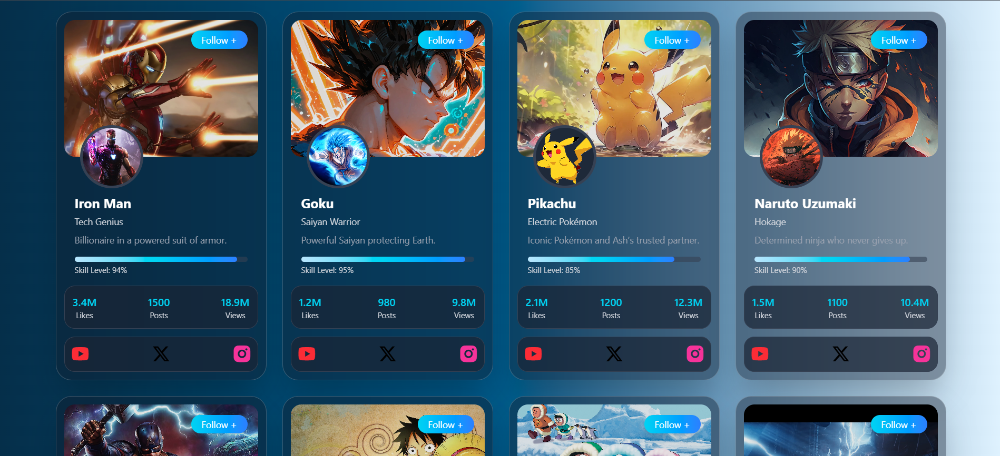

# 🎴 Card-Verse

A modern, responsive card showcase application built with React and Vite, featuring stunning character cards with interactive animations and glassmorphism effects.



## 📖 About The Project

Card-Verse is a visually appealing web application that displays character cards from various universes including Marvel superheroes, anime characters, and Pokémon. Each card features a unique design with:

- **Profile & Cover Images**: Eye-catching visuals for each character
- **Character Information**: Name, role, and biography
- **Skill Level Indicator**: Visual progress bar showing character abilities
- **Statistics Dashboard**: Displays likes, posts, and views
- **Social Media Links**: Quick access to YouTube, Twitter, and Instagram
- **Interactive Animations**: Smooth hover effects and transitions
- **Glassmorphism UI**: Modern frosted glass effect with backdrop blur

## ✨ Features

- 🎨 **Modern UI Design** - Glassmorphism and gradient effects
- 🖼️ **Character Cards** - Beautiful card layout with profile pictures
- 📊 **Dynamic Stats** - Real-time statistics display for each character
- 💫 **Smooth Animations** - Hover effects and transitions
- 📱 **Responsive Design** - Works seamlessly on all devices
- ⚡ **Fast Performance** - Built with Vite for optimal speed
- 🎯 **Reusable Components** - Modular React components

## 🛠️ Built With

- **React 19.2.0** - JavaScript library for building user interfaces
- **Vite 7.2.4** - Next-generation frontend build tool
- **Tailwind CSS** - Utility-first CSS framework (via custom styling)
- **Remix Icons** - Icon library for social media icons
- **ES6+ JavaScript** - Modern JavaScript features

## 🚀 Getting Started

### Prerequisites

Make sure you have Node.js installed on your machine.

### Installation

1. Clone the repository
   ```bash
   git clone https://github.com/AlokKumarYadav2410/card-verse.git
   ```

2. Navigate to the project directory
   ```bash
   cd card-verse
   ```

3. Install dependencies
   ```bash
   npm install
   ```

4. Start the development server
   ```bash
   npm run dev
   ```

5. Open your browser and visit `http://localhost:5173`

## 📂 Project Structure

```
card-verse/
├── src/
│   ├── Components/
│   │   └── Cards.jsx          # Main card component
│   ├── Data/
│   │   └── mixedCharacters.js # Character data
│   ├── assets/
│   │   ├── pokemon.png
│   │   └── preview.png
│   ├── App.jsx                # Main application component
│   ├── main.jsx               # Entry point
│   └── index.css              # Global styles
├── public/                    # Static assets
├── index.html                 # HTML template
├── package.json               # Project dependencies
└── vite.config.js            # Vite configuration
```

## 🎯 Available Scripts

- `npm run dev` - Start development server
- `npm run build` - Build for production
- `npm run preview` - Preview production build
- `npm run lint` - Run ESLint for code quality

## 🎨 Card Features

Each character card includes:

- **Cover Image** - Full-width background image
- **Profile Avatar** - Circular profile picture with border
- **Follow Button** - Interactive follow action
- **Character Details** - Name, role, and biography
- **Skill Progress Bar** - Visual representation of skill level
- **Statistics Panel** - Likes, posts, and views count
- **Social Media Icons** - YouTube, Twitter (X), and Instagram links

## 🌟 Character Collection

The app showcases popular characters including:
- Iron Man (Marvel)
- Goku (Dragon Ball)
- Pikachu (Pokémon)
- And many more!

## 🤝 Contributing

Contributions are welcome! Feel free to:
1. Fork the project
2. Create your feature branch (`git checkout -b feature/AmazingFeature`)
3. Commit your changes (`git commit -m 'Add some AmazingFeature'`)
4. Push to the branch (`git push origin feature/AmazingFeature`)
5. Open a pull request

## 📝 License

This project is open source and available under the MIT License.

## 👨‍💻 Author

Created with ❤️ as part of React practice projects

## 🙏 Acknowledgments

- Character images sourced from Wallpaper Cave
- Icons from Remix Icon
- Inspired by modern UI/UX design trends

---

⭐ If you like this project, please give it a star on GitHub!